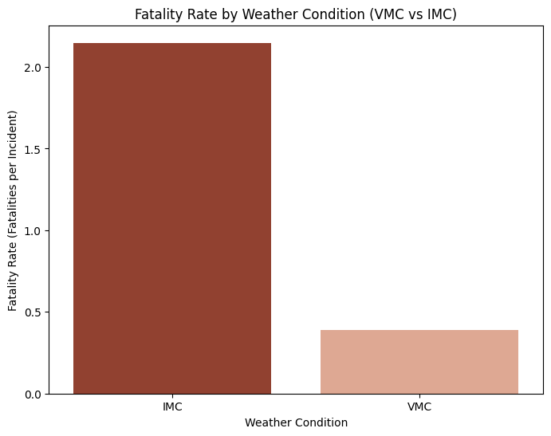
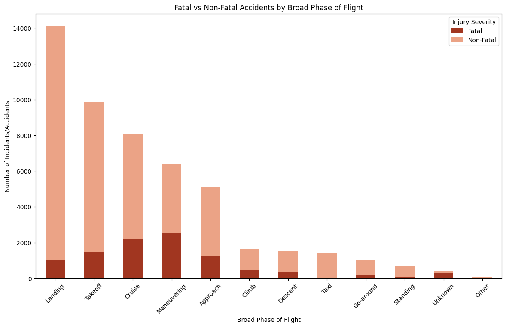
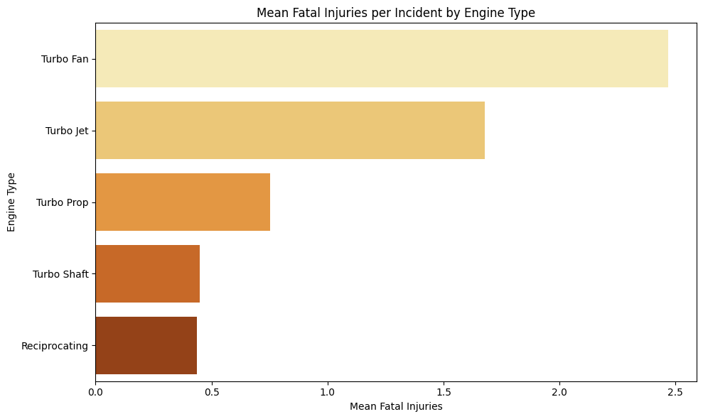
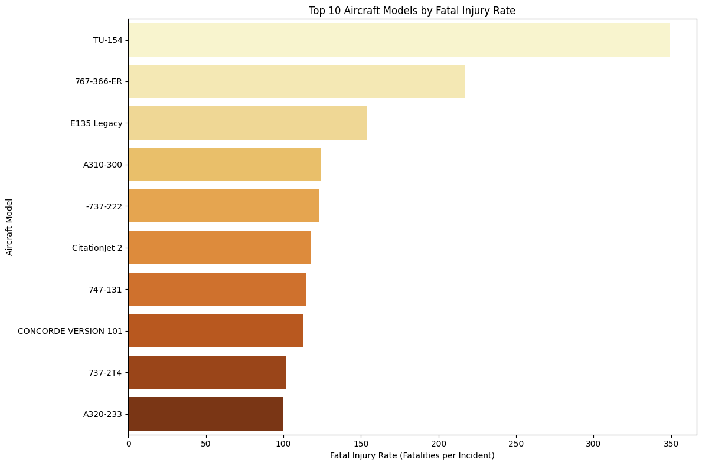
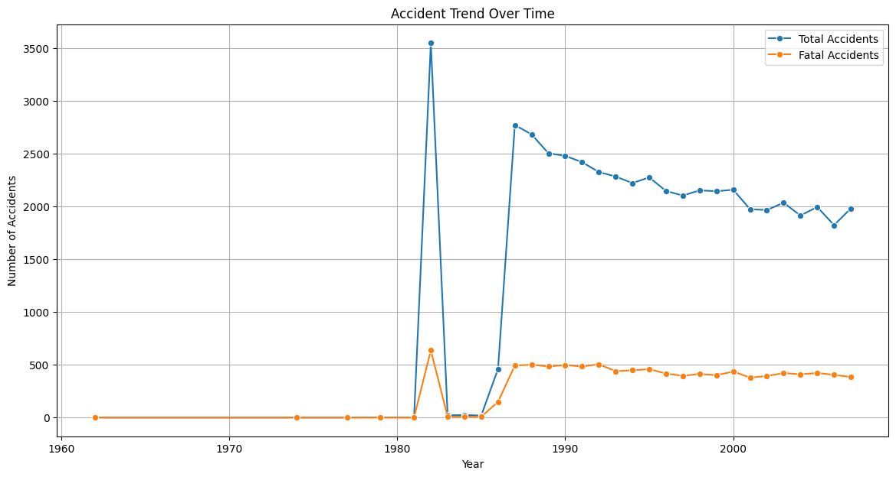

**Reducing Aviation Investment Risk: A Data-Driven Analysis of Aircraft Safety**

Author: ***Marcus Kaula***

**AVIATION DATA**

***Tableau link***: https://public.tableau.com/views/Aviation_17660534129580/Aviation?:language=en-US&:sid=&:redirect=auth&:display_count=n&:origin=viz_share_link

**OVERVIEW**

The aviation industry iss a highly regulated and risk sensitive sector where safety, reliability and operational performance are critical to business success. As organizations seek to expand into aviation related ventures, data driven insights become essential for minimizing risk and supporting startegic investment decisions.

This project utilizes historical aviation accident data provided by the National Transport Safety Board(NTSB), covering civil aviation accidents and selected incidents from 1962 to 2023. The dataset contains detailed information on aircrafts characteristics, accident cicrcumstances and injury outcomes. By analyzing this data, the project aims to identify patterns and trends relatedto aircraft safety and accident saverity over time.

Through exploratory data analysis, data cleaning, imputation and visualization, this project seeks to transform raw accident recrds into meaningful insights. These insights will support business stakeholders in evaluating aircraft risk levels and making informed decisions when entering the aviation market.

**PROBLEM STATEMENT**

Key challenges faced by decision-makers include:

- Identifying aircraft with the lowest historical accident and fatality rates

- Understanding how accident severity differs across aircraft types and categories

- Evaluating trends in aviation safety over time

- Translating technical safety data into clear, actionable business insights

This project seeks to answer the following question:

“Which aircraft present the lowest operational risk based on historical accident and injury data, and how can these insights guide safe and strategic aircraft acquisition decisions?”

Addressing this problem will enable business leaders to make evidence based aircraft purchasing decisions, reduce exposure to safety risks, and establish a strong foundation for successful entry into the aviation industry.

**ANALYSIS**

*Key Observations*

1. Across the top 10 aircraft manufacturers, non-fatal incidents significantly outnumber fatal incidents, but the ratio of fatal to non-fatal outcomes varies noticeably by manufacturer with the ratio of fatal to non fatal injuries slightly higher in Mooney.

2. Some manufacturers with high total incident counts show relatively low fatal counts, while others exhibit a higher proportion of fatal outcomes per incident, indicating differences in severity rather than frequency.

*Key Observations*

1. IMC accidents have a significantly higher fatality rate per incident than VMC accidents.

2. While VMC accidents occur more frequently, they result in fewer fatalities per event, indicating lower severity.

*Key Observations*

1. A small number of flight phases account for the majority of both total and fatal accidents.

2. Some phases like Maneuvering and Cruise phase show a higher proportion of fatal outcomes, indicating elevated risk when accidents occur during those phases.

*Key Observations*

1. Certain engine types like Turbo Fan show higher average fatal injuries per incident, meaning accidents involving these engines tend to be more severe.

2. Other engine types like Reciprocating engines demonstrate lower mean fatalities, even when they appear frequently in the dataset.

*Key Observations*

1. Aircraft models vary substantially in fatal injury rate per incident, with some models like TU-154 and 767-366-ER producing far more fatalities per accident than others like 737-2T4 and A320-233.

2. High fatal injury rates occur even among models with fewer total incidents, indicating that severity, not just frequency, drives risk.

*Key Observations*

1. Total accidents have declined over time, suggesting improvements in aviation safety overall.

2. Fatal accidents have also declined, but not proportionally every year, meaning severe accidents still occur.

**Conclusions**

***Fatal vs Non-Fatal Outcomes for Top 10 Aircraft Makes***

- Aircraft manufacturer is associated not only with how often incidents occur, but with how severe those incidents tend to be. Manufacturers with lower fatal-to-non-fatal ratios present lower operational and financial risk, even if they appear frequently in accident data.

***Top 10 Aircraft Models by Fatal Injury Rate***

- Aircraft model choice has a direct and measurable impact on accident severity, making fatal injury rate a more relevant risk metric than raw accident counts.

***Mean Fatal Injuries per Incident by Engine Type***

- Engine type influences accident severity, not just aircraft performance, and should be treated as a core safety consideration in acquisition decisions

***Fatal vs Non-Fatal Accidents by Broad Phase of Flight***

- Accident risk is not evenly distributed across flight operations specific phases represent concentrated points of failure.

***Fatality Rate by Weather Condition (VMC vs IMC)***

- Weather conditions strongly affect accident severity, with IMC operations posing outsized fatality risk.

***Accident Trends Over Time***

- Despite overall safety improvements, high severity accidents remain a business risk, reinforcing the need for careful aircraft and operational choices.

**Recommendations**

1. Purchase aircraft from manufacturers and models with low fatal injury rates per accident, not simply low accident counts.

2. Prioritize aircrafts with strong IMC-capable systems.

3. Reduce early stage exposure by limiting IMC operations and emphasizing training during high risk flight phases.

4. Prioritize aircraft with lower risk engine types that demonstrate lower mean fatal injuries per incident, especially for early stage fleet expansion.

5. Focus pilot training, standard operating procedures, and safety monitoring on high risk flight phases, particularly approach, landing and maneuvering.
